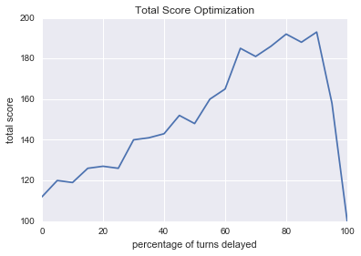
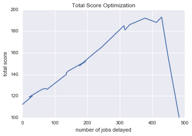

# Job Queue Game
allocate enough machines to run jobs with little delay while minimizing cost.

## Installation
* Install [Python 3](https://www.python.org/downloads/)
    * verify by typing python into a terminal and ensuring prompt states python 3.x
* Install [Requests](http://docs.python-requests.org/en/master/):

```bash
$ pip install requests
```

## Usage
For short game
```bash
    python job_queue.py 
```

For long game
```bash
    python job_queue.py long
```

To debug, import job_queue and instantiate a game:
```python
    import job_queue
    game = jobqueue.Game(long_game=False)
    # will print detailed information about each turn
    game.run_show(debug=True)
```

## Heuristic 

### Greedy Algorithm

The algorithm works by assigning new jobs to the machine with lowest available memory sufficient for the job. 
This greedy approach aims to use the full capacity of running machines before creating a new machine.

### Delay Parameter

In addition, there is an optional delay parameter between 0 and 100. A value of 0 implies no jobs are delayed. 
If no running machine has capacity to run the job, a new machine is created. 
A value of 100, implies all jobs run on one machine (with jobs delayed).
Delay parameter values between 0 and 100 delay the corresponding proportion of turns.
For example, a value of 25 delays 25% of turns in the game. 

### A Reasonable Solution

Since this problem is NP hard, the delay parameter allows us to tune the proportion of turns to delay for a given game to find
a reasonable compromise between delaying a job and the cost running a new machine. 
Scanning through the parameter space (see jupyter notebook `optimize delay parameter`) a delay value of 90 seems to yield the best total score for a short game: 





* repeated games give a total score between 174 to 193 for a short game. 

The delay value can be tuned by instantiating a game with an optinal parameter for delay:

```python
    import job_queue
    game = jobqueue.Game()
    # default delay for short game is 90 
    game.run_show(delay=25)
```

For a long game, a reasonable delay value seems to also be between 80-100. The default value is also 90.

## Implementation Details

The algorithm is implemented using a Game class in `job_queue.py`. Modelling the problem as an object makes it easier to track 
variables needed for the game: number of machines running, new jobs, current turn, etc. as well as encode methods which can perform 
the steps needed for the algorithm. Unit tests ensure methods such as game instantiation, machine creation/deletion, job assignment, and next turn work as expected (see `tests.py`) This approach also allows multiple game instances to exist in the same code (including multiple short and long games).

Jobs and running machines are stored as hash tables within instance variables, which can be updated by each method as needed. 
This allows for constant time lookups no matter how many jobs or machines are running. In addition, calls to the API are made using 
a class level variable (which isn't duplicated for each instance) containing the base url. The methods have descriptive names such as `next_turn()`, `create_machine()`, and so on. They also include doc strings outlining the expected inputs, procedure, and output.

The algorithm is executed by calling `run_show()` on an instance of the game, which calls `next_turn()` to advance the game's turn, `manage_jobs()` to 
assign jobs according to the greedy algorithm and delay factor, as well as `terminate_free_machiens()` which deletes machines without any running jobs 
after each turn. At each turn, the algorithm loops through the jobs in the queue. If a job is not assigned to a machine, the algorithm assigns the job to a machine---doing so, requires looping through running machines. However, looking up information about machines or job at each turn is O(1). The total 
runtime complexity in the worst case is number of unassigned jobs * number of running machines per turn.

* note: API doesn't register the game's state as finished until jobs have finished running. A short game may go on for more than 50 turns until all jobs run.

The code is also organized so that a game runs only if the code is executed, but not if it's imported. This allows for modular code that can be imported elsewhere, like a Jupyter notebook without any conflicts. Tests can be executed using the PyTest module on `test.py`.


code is available at: https://github.com/marksibrahim/custora
